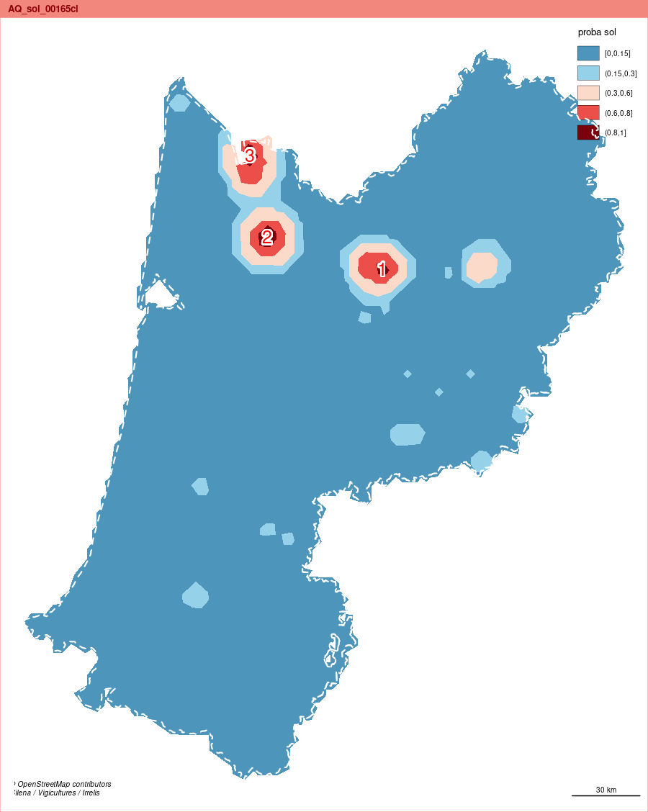
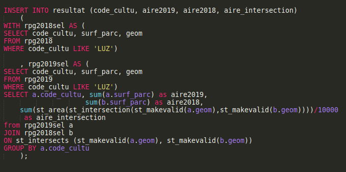

background-image: url("css/pg1.jpg")

---
background-image: url("css/pg2.jpg")

class: right, bottom

# Rapport d'étonnement
## Non !
---


background-image: url("img/03_tendre.jpg")

---

# Rapport de regret du pays

.pull-left[

]


## Celui de la recherche

---

# Tout ce que j'aurais voulu faire

--

## Script

--

## Cartographie

--

## Projets (segment et surtout le rpg)

---


# Tout scripter ...


.pull-left[
```{r, eval=FALSE}
library(sf)
library(cartography)
reg <- st_read("data/data.gpkg", "regionS", quiet = TRUE)
reg$equipe <- c("equipeMP", "equipeNO", "equipeAQ")
png("img/06_equipe.png", width = 400, height = 400, res = 100)
par(mar = c(0,0,1.2,0))
typoLayer(reg, var = "NOM_REG", legend.pos = "left", border = NA, legend.values.cex = 0.8, legend.title.txt = "")
layoutLayer("Equipes Géostatathon", col = "#BFB299")
dev.off()
```
]

.pull-right[

]


---

# Automatiser la production des cartes météo

```{r, eval = FALSE}
  # interpolation
  interp_IDW <- raster::interpolate(grilleR, fit_IDW)
  # le résultat est un carré recouvrant la grille
  # on met le fond en masque pour avoir le contour
  interpMasque <- raster::mask(interp_IDW, fond)
  # transformation de l'objet en sf
  interpsf <- st_as_sf(raster::rasterToPolygons(interpMasque))
```

---
# Faire un package R utile !

.pull-left[
### Pas d'image car pas d'accès au gitlab depuis internet
]
.pull-right[

]
---

# Utiliser diplyr !

## Transposition données colonne ligne

```{r, eval = FALSE}
# parcours de dataFiltre
nb <- length(dataFiltre$ID_CANTON)
i <- 1
for (i in 1:nb) {
  surface <- dataFiltre$SURFACE [i]
  canton <- dataFiltre$ID_CANTON [i]
  culture <- dataFiltre$CULTURE [i]
  df [df$ID_CANTON == canton ,  culture] <- surface
}
```


---

# Script

--

### Utiliser diplyr

--
### Tout scripter

--

### Automatiser les cartes météo mensuelles

--

### Faire un package R arvalis avec le template

--
## Autres regrets : les regrets cartographiques...


---

# Un fond 

.pull-left[
## La France appartient à l'Europe
]
.pull-right[

]
--

### Y compris l'Andorre...

---

# Cartographier des évolutions


.pull-left[

]
.pull-right[
### Basculement culture méditerranéenne
]

---

# Raster - Vecteur

.pull-left[

]

.pull-right[

]

---

# interpolation et potentiel


.pull-left[

]
.pull-right[

]

---

# Lisser les cartes

.pull-left[

]
.pull-right[

]

---

# Cartographie

--

### Fond européen

--

### Illustrer des évolutions


--
### différences vecteur / raster

--

### Interpolation et potentiel
--

### Faire des cartes lissées

--

## Derniers regrets : projets !

---

# Projet segment

### Pourquoi certaines villes extraites des segments ?


---

# Projet RPG

### Requêter le RPG 



---

# Utiliser le PHP


---

# Correspondre avec l'INRAE


---

# Projets

### Segment : les villes ?

### RPG : requête, php, et mails

---

# Et surtout, surtout....

--

### Finir l'écophysiologie du blé !

