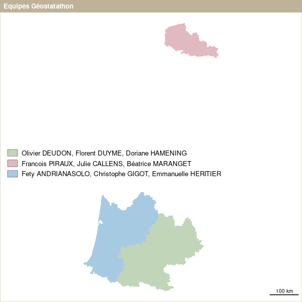
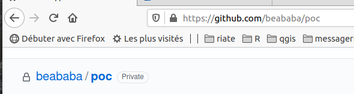

background-image: url("css/pg1.jpg")

---
background-image: url("css/pg2.jpg")

class: right, bottom

# La nature renait !
## Balade de R à internet !
---


background-image: url("img/perceneige.jpg")

---


# Etapes


.left-column30[ 

## Juste quelques mots nouveaux

]


.right-column70[


]

--

### 🤔 C'est très simple !

---


# R et markdown


```{r setup, include=FALSE}
knitr::opts_chunk$set(echo = TRUE)
knitr::opts_chunk$set(cache = FALSE)
# Passer la valeur suivante à TRUE pour reproduire les extractions.
knitr::opts_chunk$set(eval = FALSE)
knitr::opts_chunk$set(warning = FALSE)
```

.pull-left[
```{r}
library(sf)
library(cartography)
reg <- st_read("data/data.gpkg", "regionS", quiet = TRUE)
reg$equipe <- c("equipeMP", "equipeNO", "equipeAQ")
png("img/06_equipe.png", width = 400, height = 400, res = 100)
par(mar = c(0,0,1.2,0))
typoLayer(reg, var = "NOM_REG", legend.pos = "left", border = NA, legend.values.cex = 0.8, legend.title.txt = "")
layoutLayer("Equipes Géostatathon", col = "#BFB299")
dev.off()
```
]

.pull-right[

]


--

## 🤔 Du chunk à l'image !

---

# Git (1)

## Une plateforme de "versioning"

### Un logiciel de gestion de versions décentralisé (Wikipedia)




---

# Git (2)

## Possibilité site web


### [Comment faire ?](https://putaindecode.io/articles/creer-un-site-web-gratuitement-avec-github-pages/)

### [Un bon exemple](https://rcarto.github.io/carto_avec_r/)

---


# Site web

.left-column30[ 


]


.right-column70[


## 3 élements :

]

--

###  Un langage de *balise* (HTML)

--

###  Une cascade de *styles* (CSS)

--

###  Une *librairie* javascript : remarks.js


---

# Tout est là !


.left-column30[ 


##  [ici, cette présentation](https://github.com/beababa/beababa.github.io)


]

.right-column70[


]
