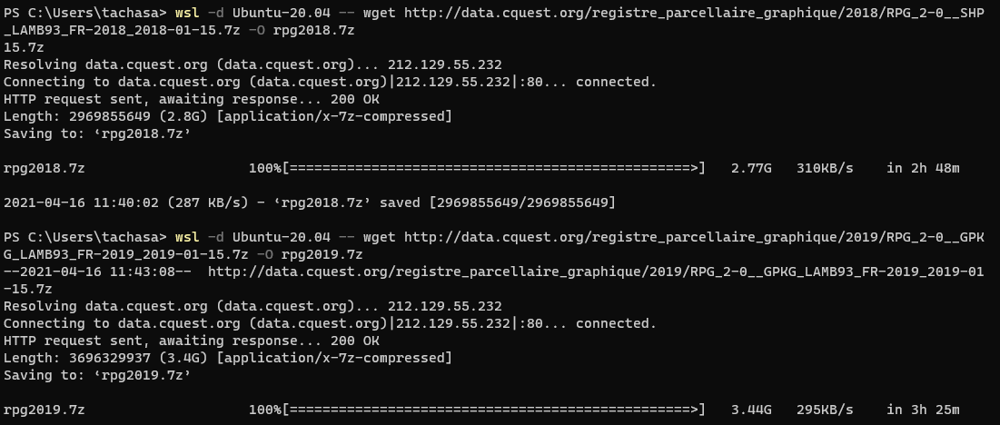
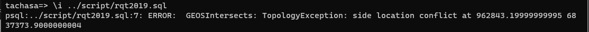
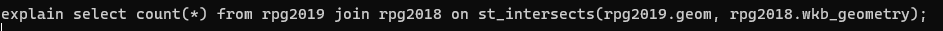
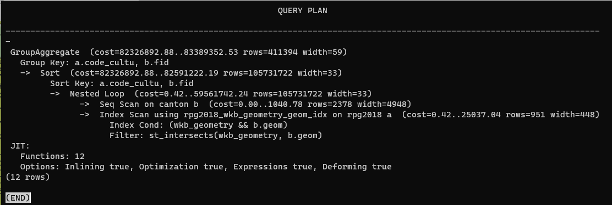
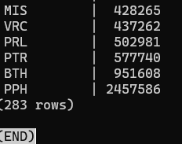
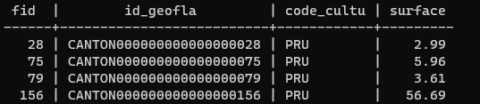
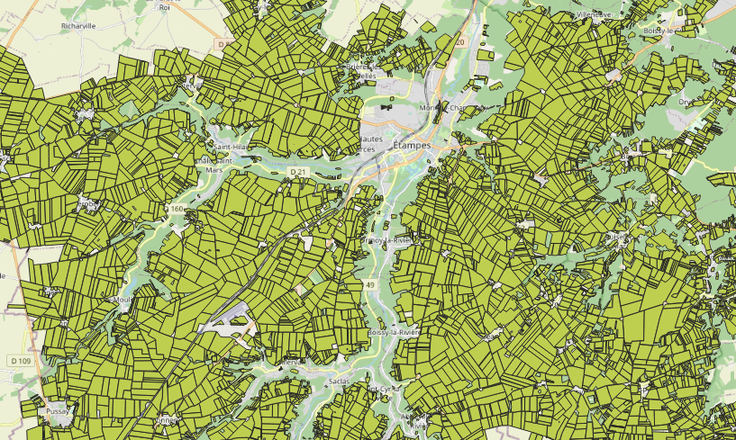

background-image: url("css/pg1.jpg")

---
background-image: url("css/pg2.jpg")

class: right, bottom

# RPG dans Postgis
## Présentation au service
---


```{r setup, include=FALSE}
knitr::opts_chunk$set(echo = TRUE)
knitr::opts_chunk$set(cache = TRUE)
# Passer la valeur suivante à TRUE pour reproduire les extractions
knitr::opts_chunk$set(eval = FALSE)
knitr::opts_chunk$set(warning = FALSE)
```


# Objet

###  Présenter l'import du rpg dans une base postgis et quelques requêtes.

--

### Décrire également la mise en place de l'environnement wsl / ubuntu 20 / postgis

--


---


# Sources

https://static.geotribu.fr/articles/2020/2020-10-28_gdal_windows_subsystem_linux_wsl/#installer-wsl

http://data.cquest.org/registre_parcellaire_graphique/2018/

https://georezo.net/forum/viewtopic.php?id=123178

https://postgis.net/install/

https://jayrobwilliams.com/posts/2020/09/spatial-sql

https://freegistutorial.com/how-to-install-postgis-on-ubuntu-20-04/

--

#### Liste non exhaustive...


---

# Installations

## Pourquoi wsl ?


---

# Retrouver la ligne de commande sous Windows



###      complétion et historique

---

# Le composant gdal


--

####  - nlt

--

#### - makevalid

---

# La commande ogr pour l'import des tables spatiales du rpg

```{bash}
ogr2ogr -f PostgreSQL "PG:user=tachasa dbname=tachasa password=bonbon2021" PARCELLES_GRAPHIQUES.gpkg -nln rpg2019 -nlt POLYGON -a_srs EPSG:2154
```


#### L'import des tables se fait *rapidement*.


---

# Installation postgis 

##     5 lignes !

```{bash}
sudo -i -u postgres
create user tachasa
createdb tachasa -O tachasa
psql -d tachasa
CREATE EXTENSION postgis;

et ensuite /i rqt.sql

pb droits GRANT ALL ON nomtable TO tachasa;
```

---

# Requêtes SQL

## Puissance du SQL

```sql
drop table if exists cantonrpg;
CREATE TABLE cantonrpg AS (
SELECT a.*
FROM rpg2018 a JOIN canton b ON ST_WITHIN (a.wkb_geometry, b.geom)
WHERE b.fid = 1888
	);
```

---

# Une requête de dénombrement

```sql
SELECT a.code_cultu, count(*) AS nb
FROM rpg2018 a
GROUP BY code_cultu
ORDER BY nb ASC;
```


---

# Plus difficile : la manipulation des données spatiales


```sql
CREATE TABLE rpgcanton2018 AS (
SELECT b.fid, b.id_geofla,a.code_cultu, sum(a.surf_parc)  AS surface
FROM rpg2018 a JOIN canton b
ON ST_INTERSECTS (st_makevalid(a.wkb_geometry), st_makevalid( b.geom))
	GROUP BY a.code_cultu, b.fid
	)
```



---

# Possibilité d'optimiser avec le queryplan ?






---

# Et demain ?

## Une personne ressource

#### L'équipe du logiciel Rpgexplorer et Philippe Martin


---
# Merci Adelaïde !


---

# Des données

Les données de l'INRAE mises à disposition par département

https://data.inrae.fr/dataset.xhtml?persistentId=doi:10.15454/XH84QB

---

# Un essai

## Requêtes culture par culture


---

# Exemple : le code cultu "PRU"

```sql
CREATE TABLE rpgcanton2018 AS (
SELECT b.fid, b.id_geofla,a.code_cultu, sum(a.surf_parc)  AS surface
FROM rpg2018 a JOIN  canton b
ON ST_INTERSECTS (st_makevalid(a.wkb_geometry), st_makevalid( b.geom))
WHERE a.code_cultu LIKE 'PRU'
	GROUP BY a.code_cultu, b.fid)
```

--

Cette requête donne un résultat au bout de 5 mn.




---

# Bref, j'ai encore du boulot !

